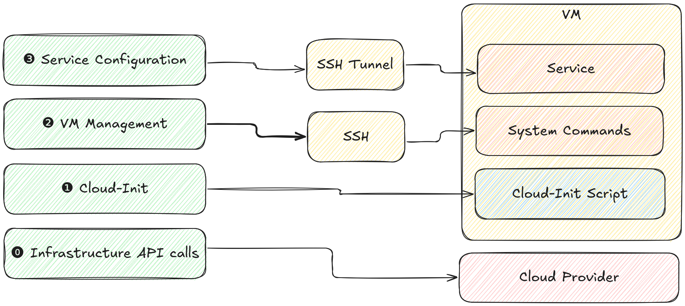

+++
title = 'Cloud'
description = 'Locally managed cloud services on bare VMs'
overviewGroup = "cloud"
faIcon = "fa-cloud"
+++

Solidbloks cloud is a standalone CLI tools that creates high level managed services on bare virtual machines, networking and storage. No container schedulers, no cloud specific services, just plain Linux running services, managed via SSH.

## Quickstart

**create config `cloud1.yml`**  
```yaml
{}
```

**apply config**
```shell
blcks cloud apply cloud1.yml 
[...]

service endpoints: http://<ip adress>
```

**access the deployed service**

```shell
curl http://<ip adress>
```

## Overview

### Design
 
* Only basic building blocks that are widely available across the majority of cloud providers are used, e.g. VM, storage disks, DNS and private networking to keep the setup simple and portable
* Instead of complex container schedulers or API driven control-planes Solidblocks clouds relies on plain Unix services and docker containers started with systemd
* No extra or intermediary state is used, the source of truth is the configuration file. Resources are identified solely based on its name
* Apart from the data disks every created resource must be treated as ephemeral. It must always be possible to re-provision from scratch and get the same system-state as before
* The created VMs can survive standalone, it must always be possible to use them without Solidblocks cloud
* It is open for integration of resources that are managed out of band with other IaC tools

### Configuration

The configuration file is the central source of truth for all deployments. It is YAML based and defines the services to deploy and where to deploy them

**example**
```yaml
{}
```

### Resource Identity

The model and the created resources are linked using a predictable resource names. E.g. for the cloud named `cloud1` and the service `webservice1` the resource name for the virtual machine will be `cloud1-default-webservice1-0` following the pattern `<cloud_name>-<envrionment_name>-<service_name>-<index>`

{}
Environment (`<envrionment_name>`) and multiple instance support (`<index>`) are not yet implemented, but already incorporated in the naming scheme to allow for a smooth transition in the future, see roadmap. 
{}


### Provisioning Process

The provisioning process is divided into multiple steps


#### Configuration to model

The configuration is read and transformed into an internal model. This model expands the configuration into the different infrastructure components that are needed to fulfill the requested service configuration. E.g. a service of the type `postgres` is built from:
 * a VM running the PostgreSQL database
 * a disk holding the PostgreSQL data
 * a backup disk holding the database backups
 * s secret for the PostgreSQL admin user
 * a DNS entry pointing to the database
 * a firewall rule restricting access to the database
 * ...

#### Running state to diff

The infrastructure resources from the created model that should be running are compared with the currently running state. From this comparison a diff is created containing the resources that need to be created or modified.

#### Diff to Resources

The changed resource from the diff are then created or modified to achieve the desired state from the model.


### Provisioning Methods




Different methodologies are used to provision services. 

#### ⓿ Infrastructure API calls

At the lowest layer, cloud resources are created using the public API of the underlying cloud provider.

#### ❶ Cloud-Init

The created machines are started using a service specific cloud-init script that will bootstrap the desired service.

#### ❷ VM Management

If needed VM management tasks are executed over SSH. This could be service start/restart, system updates, file provisioning etc.

#### ❸ Service Configuration

When the service is started and if needed further configuration done on the services API using an SSH tunnel to prevent potential sensitive APIs from being exposed on the internet. This could for example be the creation of users and schemas on a database. 
