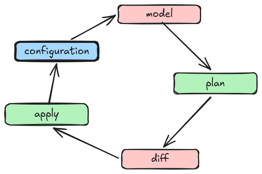
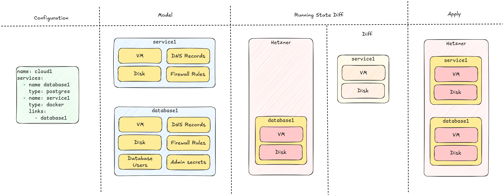

+++
title = 'Design & Development'
+++

The overall design of Solidblocks cloud is led by the following rules

* Only basic building blocks that are widely available across the majority of cloud providers are used, e.g. VM, storage disks, DNS and private networking to keep the setup simple and portable
* Instead of complex container schedulers or API driven control-planes Solidblocks clouds relies on plain Unix services and docker containers started with systemd
* No extra or intermediary state is used, the source of truth is the configuration file. Resources are identified solely based on its name
* Apart from the data and backup disks, every created resource must be treated as ephemeral. It must always be possible to re-provision from scratch and get the same system-state as before
* The created VMs can survive standalone, it must always be possible to use them without Solidblocks cloud
* It is open for integration of resources that are managed out of band with other IaC tools
* It optimizes for MTTR over MTBF, instead of complicated failover or rolling update processes, short outages during service deployments are acceptable


## Overview

Solidblocks cloud uses a cyclic process starting with a high level `configuration` that is transformed into a runtime `model` defining all resources that are needed to implement the services. During the `plan` phase this model is compared with the running state inside the cloud, and a `diff` is created containing all missing or changed resources. Based on this `diff` during the `apply` phase the running state is diverged towards the intended `model` derived from the `configuration`.




## Provisioning Process



#### Configuration to model

The configuration is read and transformed into an internal model. This model expands the configuration into the different infrastructure components that are needed to fulfill the requested service configuration. E.g. a service of the type `docker` is built from:
 * a VM running the service
 * a disk holding the services data
 * a backup disk holding the data backups
 * a DNS entry pointing to the service
 * a firewall rule restricting access to the service
 * ...

#### Running state to diff

The infrastructure resources from the created model that should be running are compared with the currently running state. From this comparison a diff is created containing the resources that need to be created or modified.

#### Diff to Resources

The changed resources from the diff are then created or modified to achieve the desired state from the model.


### Provisioning Methods


Different methodologies are used to provision services. 

#### ⓿ Infrastructure API calls

At the lowest layer, cloud resources are created using the public API of the underlying cloud provider.

#### ❶ Cloud-Init

The created machines are started using a service specific cloud-init script that will bootstrap the desired service.

#### ❷ VM Management

If needed VM management tasks are executed over SSH. This could be service start/restart, system updates, file provisioning etc.

#### ❸ Service Configuration

When the VM is started via cloud init, all further service configuration is done via an SSH tunnel port forward to prevent potential sensitive APIs from being exposed on the internet. This could for example be the creation of users and schemas on a database. 


### Resource Identity
The model and the created resources are linked using a predictable resource names. E.g. for the cloud named `cloud1` and the service `webservice1` the resource name for the virtual machine will be `cloud1-default-webservice1-0` following the pattern `<cloud_name>-<envrionment_name>-<service_name>-<index>`

{}
Environment (`<envrionment_name>`) and multiple instance support (`<index>`) are not yet implemented, but already incorporated in the naming scheme to allow for a smooth transition in the future, see roadmap.
{}


### Providers

Providers enable Solidblocks cloud to create all the needed resources like virtual machines, storage volumes, DNS entries or secrets to implement a service. For a minimal cloud configuration at least one of the four different provider types is needed:

* **SSH key provider**
  Used to load SSH keys that are used for cloud VM management via SSH.

* **Secret Provider** To provision and manage services, secrets are needed for API keys, database users, etc. The secret provider is used to store and retrieve secrets.

* **Cloud Provider** The cloud provider implements the creation of the needed cloud resources like virtual machines, storage volumes, firewall, etc.

* **Backup Provider** Manages the resources needed to store and retrieve backups for disaster recovery purposes.

## Development

This chapter gives an overview over the internal structure and core concepts of the Solidblocks Cloud project sources

### Configuration Parsing

`de.solidblocks.cloud.configuration.ConfigurationFactory`s are used to transform the configuration YAML into `*Configuration` data objects. Each factory defines a list of keywords that it understands where each `de.solidblocks.cloud.configuration.Keyword` includes name, constraints (range, max length, optional, etc.) and a help that is used to validate the configuration YAML and generate a help for the configuration file format.
For polymorphic lists that can contain different types, the `type` keyword is used to find the appropriate `ConfigurationFactory`.

```kotlin
interface ConfigurationFactory<T> {
    val help: ConfigurationHelp
    val keywords: List<Keyword<*>>
    fun parse(yaml: YamlNode): Result<T>
}
```

```
---                     | RootConfigurationFactory
name: cloud1            | StringKeyword("name")
                        |
services:               | PolymorphicListKeyword("services") 
  - type: service_a     | PolymorphicConfigurationFactory("service_a)
    name: service1      | StringKeyword("name")
  - type: service_b     | PolymorphicConfigurationFactory("service_b)
    name: service2      | StringKeyword("name")
    options:            | PolymorphicListKeyword("options")
      - type: option1   | PolymorphicConfigurationFactory("option1)
        name: foo       | StringKeyword("name")
      - type: option2   | PolymorphicConfigurationFactory("option2)
        name: bar       | StringKeyword("name")
```

### Configuration Validation

When the whole configuration YAML is parsed, the resulting `*Configuration` data objects are validated by

* `de.solidblocks.cloud.CloudManager.validate`
* `de.solidblocks.cloud.providers.ProviderManager.validateConfiguration`
* `de.solidblocks.cloud.services.ServiceManager.validateConfiguration`

During validation the data is also enriched (e.g. some providers take parts of their configuration from environment variables) and transformed into `*ConfigurationRuntime` data objects which are the objects all later processing and provisioning happens on.

### Service and Provider Registrations

All the different `ConfigurationFactory`s, `ProviderManager`s and `ServiceManager`s manager are registered and linked by `de.solidblocks.cloud.providers.ProviderRegistration` respectively `de.solidblocks.cloud.services.ServiceRegistration` registrations that define

* the `type` of the specific provider or service used to lookup factories during YAML parsing
* what kind of `*Configuration` class it understands
* what kind of `*ConfigurationRuntime` class it understands
* which `ConfigurationFactory` to use for parsing
* which `ProvidderManager`/`ServiceManager` to use

### Infrastructure Provisioners

Each type of resource that is handled like VMs, storage volumes or database users is defined by a triple of the following classes

* `de.solidblocks.cloud.api.resources.BaseInfrastructureResource(name, dependsOn, ...)`
  * defines the desired state of the resource
* `de.solidblocks.cloud.api.resources.BaseInfrastructureResourceRuntime(name, ...)`
  * represents the currently running state of the resource
* `de.solidblocks.cloud.api.resources.InfrastructureResourceLookup(name, dependsOn, ...)`
  * key for looking up a resource

all types share the `name` attribute which is used to link the model to the running resources (see Resource Identity). 

The heavy lifting of resource provisioning and configuration is then handled by 

* `de.solidblocks.cloud.api.InfrastructureResourceProvisioner.diff(resource, ...)`
  * takes a desired resource state and calculates the diff against the current runtime state 
* `de.solidblocks.cloud.api.InfrastructureResourceProvisioner.apply(resource, ...)`
  * diverges the current runtime state towards the desired resource state  
* `de.solidblocks.cloud.api.ResourceLookupProvider.lookup(lookup, ...)`
  * get the current runtime state for a resource
  
The orchestration of all provisioners happens in `de.solidblocks.cloud.provisioner.Provisioner` where the plan and apply phases are planned.  

### Resource Creation and Cloud-Init

The aforementioned resources are created by the services `de.solidblocks.cloud.services.ServiceManager.createResources(...)` building up on the available `InfrastructureResourceProvisioner`s. The Userdata scripts for VM provisioning via Cloud-Init are generated from the type-safe script and configuration file builders from `de.solidblocks.shell`.

