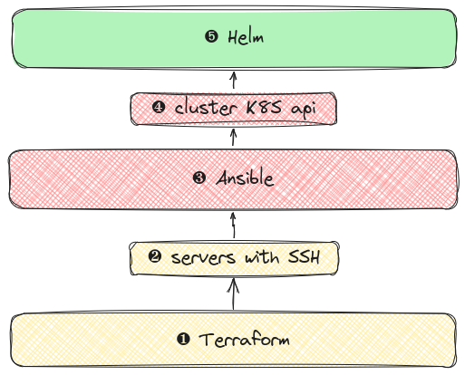
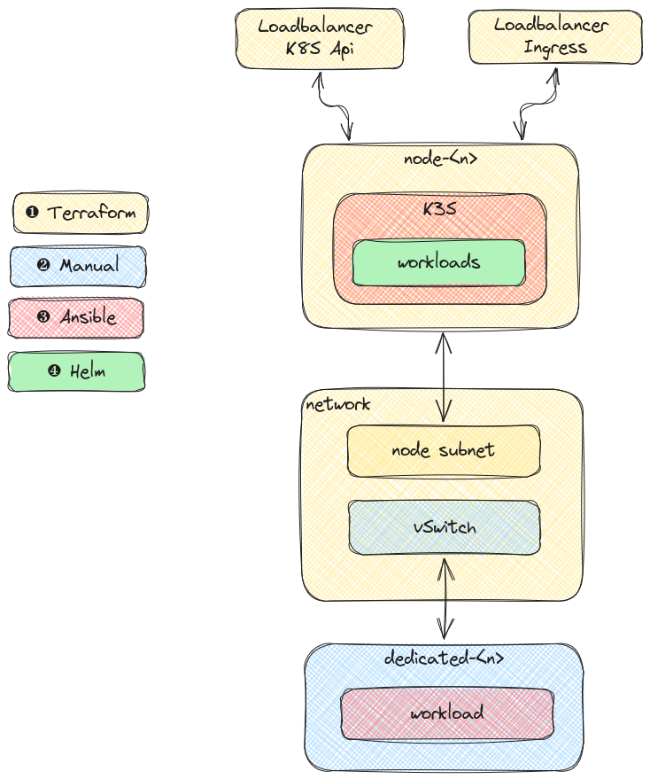
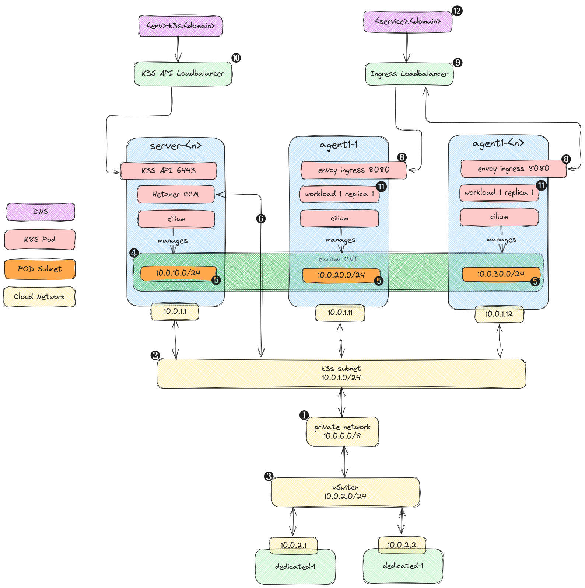
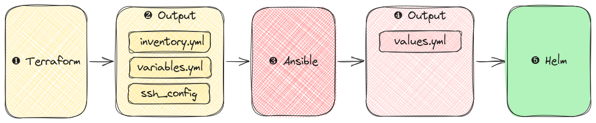

+++
title = "K3S"
overviewGroup = "k8s"
faIcon = "fa-cloud"
description = "Deploy K3S clusters in the Hetzner cloud"
+++

Solidblocks K3S is a collection of Terraform modules, Ansible roles and Helm Charts designed to provide a [K3S](https://k3s.io/) based Kubernetes cluster on Hetzner cloud resources.

## Architecture

Solidblocks is split up into three layers building up on each other

* After provisioning of cloud resources with Terraform ❶ servers are up and running SSH ❷
* Ansible takes over provisioning ❸ leading to a K8S cluster with a accessible K8S api ❹
* Finally all cluster workloads are deployed using Helm ➎

### Provisioning

* ❶ all cloud resources are provisioned using Terraform
  * virtual machines for K3S server and agent nodes
  * private networking for internal communication between nodes
  * public loadbalancer providing load-balanced access to K8S API
  * public loadbalancer for access to workload ingress
* ❷ non-cloud resources like dedicated servers can optionally be attached via [Hetzner vSwitch](https://docs.hetzner.com/robot/dedicated-server/network/vswitch)
  * This is a good option for workloads that have high I/O or memory and CPU requirements like databases
* ❸ Ansible to provision K3S to virtual machines and dedicated servers
* ❹ once K3S is running, all K8S workloads are deployed using Helm charts

### Networking

* ❶ all resources are attached to subnets inside the private network   
* ❷ statically assigned IP addresses for K3S nodes in dedicated subnet
* ❸ dedicated servers can optionally be made accessible using a subnet attached to a [vSwitch](https://docs.hetzner.com/robot/dedicated-server/network/vswitch)
* ❹ Cluster networking provided by [Cilium](https://cilium.io/) with a dedicated per node subnets ➎ for service and pod addresses
  * [Hetzner cloud controller manager](https://github.com/hetznercloud/hcloud-cloud-controller-manager) ➏ ensures the pod subnets are [native](https://docs.cilium.io/en/stable/network/concepts/routing/#id3) routed within the private network ❶ and accessible from other nodes
* K8S api exposed one each server node ➐ accessible via load balancer ➓
* [shared ingress](https://docs.cilium.io/en/stable/network/servicemesh/ingress/#host-network-mode) ➑ on static host port accessible via public loadbalancer ➒
* workloads ⓫ accessible by DNS name ⓬ via cilium envoy ingress ➑ routed over the public load balancer ➒ 

### Project structure

The Terraform modules, Ansible roles and Helm charts are designed best work together when the project using them adhere to some basic best practices regarding its structure. All component are built to be executed in the order of layerns they belong to from the bottom up.

Each layer produces configuration files, that are fed into the next layer

* Terraform ❶ produces an Ansible configuration and inventory ❷ containing the hosts, how to access them via SSH, among other configuration like subnet CIDRs
* The Ansible ❸ step picks up configuration from the Terraform step, provisions K3S and itself produces a configuration file for the final Helm steps ❹

* sources for different layers ❶ should reside under the root dir in a separate folder
  * environment dependent sources should go in a folder named after the environment ❷
* data that needs to be shared with layers go into an `output` ❸ folder inside the folder with the name of the next layer ❹ and environment ➎

**example project**
{}
- &lt;root&gt; | folder | #888888
    - ❶ helm | folder | #2ebc6f
    - ❶ ansible | folder | #2ebc6f
        - ❸ output | folder | info
            - ❹ helm | folder | info
                - ➎ prod | folder | #ebd129
                    - values.yml | file-alt | #888888
                - | ellipsis | #888888
    - ❶ terraform | folder | #2ebc6f
        - ❸ output | folder | info
          - ❹ ansible | folder | info
            - ➎ prod | folder | #ebd129
                - inventory.yml | file-alt | #888888
                - variables.yml | file-alt | #888888
                - | ellipsis | #888888
            - ➎ dev | folder | #ebd129
                - inventory.yml | file-alt | #888888
                - variables.yml | file-alt | #888888
                - | ellipsis | #888888
        - ❷ prod | folder  | #ebd129
            - main.tf | file-alt | #888888
            - | ellipsis | #888888
        - ❷ dev | folder  | #ebd129
            - main.tf | file-alt | #888888
            - | ellipsis | #888888
{}
