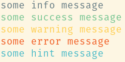
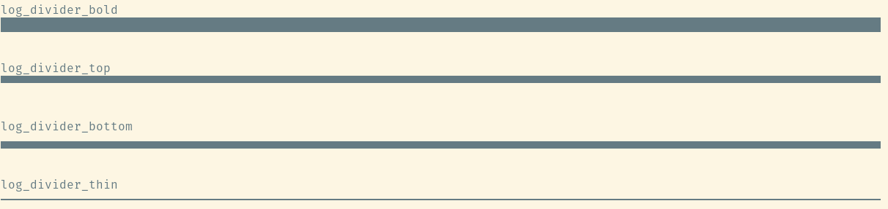

Generic console and logging  helpers

## Functions

### `log_[info|hint|success|warning|debug|error](message)` {#log}

Logs a `message` with colored log level 

```python
from solidblocks_do.log import log_info, log_success, log_warning, log_error, log_hint

log_info("some info message")
log_success("some success message")
log_warning("some warning message")
log_error("some error message")
log_hint("some hint message")
```

**output**


### `log_divider_[bold|top|bottom|thin]()` {#log_divider}

Prints a divider to structure console output, useful for interleaving with output from other CLI commands.

```python
from solidblocks_do.log import log_divider_bold, log_divider_thin, log_divider_bottom, log_divider_top

log_divider_bold()
log_divider_top()
log_divider_bottom()
log_divider_thin()
```

**output**


