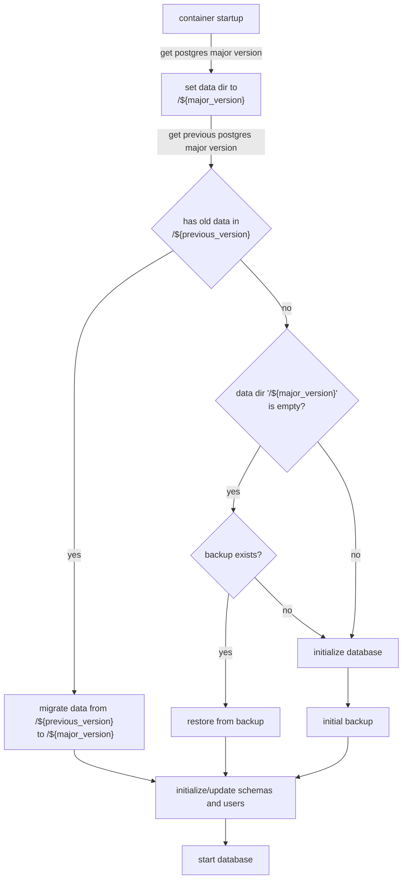

A containerized [PostgreSQL](https://www.postgresql.org/) database with an all batteries included backup solution
powered by [pgBackRest](https://pgbackrest.org/)

RDS PostgreSQL aims at being easy to use while keeping data a safe as possible. Based on the conventions of
the [official PostgreSQL docker image](https://hub.docker.com/_/postgres) it can be configured by tuning different
environment variables.

## Architecture

Configuration and backup operations are encoded in the startup script `run.sh` that implements the following flow

## Versions

The PostgreSQL version can be selected via specific docker image tags

* `ghcr.io/pellepelster/solidblocks-rds-postgresql:14-{}`
* `ghcr.io/pellepelster/solidblocks-rds-postgresql:15-{}`

Each docker image includes at least the previous PostgreSQL version for version migration purposes. The current version
can be shown with `pg_versions` and the versions are stored at `/usr/libexec/postgresql/${postgresql_major_version}`

### Upgrade

Based on the startup logic explained above and the fact that the database data is stored in a version specific
directory `/storage/data/${db_instance_name}/${postgresql_major_version}` a version upgrade looks like this:

* execute a full backup (`backup-full.sh`)
* stop container with currently running version
* start new container with the same configuration but a new PostgreSQL version
    * the new version will look for any data from a previous version and start a migration
      using [pg_upgrade](https://www.postgresql.org/docs/current/pgupgrade.html)

{}
Please keep in mind that the old data is kept and will not be deleted. This means that after an upgrade from `14`
to `15` `/storage/data/${db_instance_name}/14` is still present with the old data
and `/storage/data/${db_instance_name}/15` will contain the migrated version of the data
from `/storage/data/${db_instance_name}/14`
{}

## Configuration

### Global

| configuration                     | type        | description                                                                                                                                                                     |
|-----------------------------------|-------------|---------------------------------------------------------------------------------------------------------------------------------------------------------------------------------|
| `DB_INSTANCE_NAME`                | environment | unique name of this database instance                                                                                                                                           |
| `DB_ADMIN_PASSWORD`               | environment | Password for the db superuser, if not set a random password will be assigned. Username for the superuser is `rds`                                                               |
| `DB_POSTGRES_EXTRA_CONFIG`        | environment | Extra postgres configurations options for the `postgresql.conf`                                                                                                                 |
| `DB_BACKUP_ENCRYPTION_PASSPHRASE` | environment | Passphrase to use for backup encryption. If no passphrase is provided backups will be stored unencrypted                                                                        |
| /some/data/dir:/storage/data      | mount       | Container volume mount for the PostgreSQL data directory. The docker image uses a user with `uid` 10000, which needs to be reflected in the directory permissions               |
| /some/backup/dir:/storage/backup  | mount       | Container volume mount for the pgBackRest backup repository directory. The docker image uses a group with `gid` 10000, which needs to be reflected in the directory permissions |

### Local Backup

Based on the functionality of [pgBackRest](https://pgbackrest.org/) two types of backup repositories are supported.
Local filesystem (`local`), or an S3 compatible object storage (`s3`). Those can be configured individually, but at
least one type has to be configured.

| configuration                         | type        | default | description                                                                                                                                                       |
|---------------------------------------|-------------|---------|-------------------------------------------------------------------------------------------------------------------------------------------------------------------|
| `DB_BACKUP_LOCAL`                     | environment | 0       | Flag to enable local filesystem as backup repository                                                                                                              |
| `DB_BACKUP_LOCAL_RETENTION_FULL_TYPE` | environment | count   | Retention type for full backups, see [retention type documentation](https://pgbackrest.org/configuration.html#section-repository/option-repo-retention-full-type) |
| `DB_BACKUP_LOCAL_RETENTION_FULL`      | environment | 7       | Retention for full backups, see [retention full documentation](https://pgbackrest.org/configuration.html#section-repository/option-repo-retention-full)           |
| `DB_BACKUP_LOCAL_RETENTION_DIFF`      | environment | 4       | Retention for diff backups, see [retention diff documentation](https://pgbackrest.org/configuration.html#section-repository/option-repo-retention-diff)           |                                                                                                                                                                   |

### S3 Backup

S3 backup needs an S3 compatible backend. For non-AWS backends (like Minio) `DB_BACKUP_S3_URI_STYLE`
and `DB_BACKUP_S3_HOST`can be used to configure non-AWS servers.

| configuration                      | type        | default                       | description                                                                                                                                                                      |
|------------------------------------|-------------|-------------------------------|----------------------------------------------------------------------------------------------------------------------------------------------------------------------------------|
| `DB_BACKUP_S3`                     | environment | 0                             | Flag to enable S3 object storage as backup repository                                                                                                                            |
| `DB_BACKUP_S3_HOST`                | environment | s3.eu-central-1.amazonaws.com | Hostname of the S3 object storage service                                                                                                                                        |
| `DB_BACKUP_S3_REGION`              | environment | eu-central-1                  | AWS region                                                                                                                                                                       |
| `DB_BACKUP_S3_BUCKET`              | environment | &lt;none&gt;                  | Bucket for the backup repository                                                                                                                                                 |
| `DB_BACKUP_S3_ACCESS_KEY`          | environment | &lt;none&gt;                  | Access key for the backup bucket                                                                                                                                                 |
| `DB_BACKUP_S3_SECRET_KEY`          | environment | &lt;none&gt;                  | Secret key for the backup bucket                                                                                                                                                 |
| `DB_BACKUP_S3_CA_PUBLIC_KEY`       | environment | &lt;none&gt;                  | Public key for the CA that issued the certificates for the `DB_BACKUP_S3_HOST`. Useful when a non SaaS solution like [minIO](https://min.io/) is used.                           |
| `DB_BACKUP_S3_URI_STYLE`           | environment | host                          | See [S3 uri style](https://pgbackrest.org/configuration.html#section-repository/option-repo-s3-uri-style) Useful when a non SaaS solution like [minIO](https://min.io/) is used. |
| `DB_BACKUP_S3_RETENTION_FULL_TYPE` | environment | count                         | Retention type for full backups, see [retention type documentation](https://pgbackrest.org/configuration.html#section-repository/option-repo-retention-full-type)                |
| `DB_BACKUP_S3_RETENTION_FULL`      | environment | 7                             | Retention for full backups, see [retention full documentation](https://pgbackrest.org/configuration.html#section-repository/option-repo-retention-full)                          |
| `DB_BACKUP_S3_RETENTION_DIFF`      | environment | 4                             | Retention for diff backups, see [retention diff documentation](https://pgbackrest.org/configuration.html#section-repository/option-repo-retention-diff)                          |                                                                                                                                                                                  |

### Databases

Multiple databases can automatically be provisioned by providing configurations for multiple distinct
unique `${database_id}`s

| per database configuration   | type        | description                                                                      |
|------------------------------|-------------|----------------------------------------------------------------------------------|
| `DB_DATABASE_${database_id}` | environment | name of the database that will be crated when the PostgreSQL is initialized      | 
| `DB_USERNAME_${database_id}` | environment | name of the user who will be granted full access to `DB_DATABASE_${database_id}` |
| `DB_PASSWORD_${database_id}` | environment | password for the database user                                                   |

{}
`DB_USERNAME_${database_id}` and `DB_PASSWORD_${database_id}` can be changed at any time and will be re-provisioned on
start to allow
for easy password rotation or username change. Changing `DB_DATABASE_${database_id}` is currently not supported yet
{}

## Extensions

The following PostgreSQL extensions are available by default

| name               | version | description                                                            |
|--------------------|---------|------------------------------------------------------------------------|
| adminpack          | 2.1     | administrative functions for PostgreSQL                                |
| amcheck            | 1.3     | functions for verifying relation integrity                             |
| autoinc            | 1.0     | functions for autoincrementing fields                                  |
| bloom              | 1.0     | bloom access method - signature file based index                       |
| btree_gin          | 1.3     | support for indexing common datatypes in GIN                           |
| btree_gist         | 1.6     | support for indexing common datatypes in GiST                          |
| citext             | 1.6     | data type for case-insensitive character strings                       |
| cube               | 1.5     | data type for multidimensional cubes                                   |
| dblink             | 1.2     | connect to other PostgreSQL databases from within a database           |
| dict_int           | 1.0     | text search dictionary template for integers                           |
| dict_xsyn          | 1.0     | text search dictionary template for extended synonym processing        |
| earthdistance      | 1.1     | calculate great-circle distances on the surface of the Earth           |
| file_fdw           | 1.0     | foreign-data wrapper for flat file access                              |
| fuzzystrmatch      | 1.1     | determine similarities and distance between strings                    |
| hstore             | 1.8     | data type for storing sets of (key, value) pairs                       |
| insert_username    | 1.0     | functions for tracking who changed a table                             |
| intagg             | 1.1     | integer aggregator and enumerator (obsolete)                           |
| intarray           | 1.5     | functions, operators, and index support for 1-D arrays of integers     |
| isn                | 1.2     | data types for international product numbering standards               |
| lo                 | 1.1     | Large Object maintenance                                               |
| ltree              | 1.2     | data type for hierarchical tree-like structures                        |
| moddatetime        | 1.0     | functions for tracking last modification time                          |
| old_snapshot       | 1.0     | utilities in support of old_snapshot_threshold                         |
| pageinspect        | 1.9     | inspect the contents of database pages at a low level                  |
| pg_buffercache     | 1.3     | examine the shared buffer cache                                        |
| pg_freespacemap    | 1.2     | examine the free space map (FSM)                                       |
| pg_prewarm         | 1.2     | prewarm relation data                                                  |
| pg_stat_statements | 1.9     | track planning and execution statistics of all SQL statements executed |
| pg_surgery         | 1.0     | extension to perform surgery on a damaged relation                     |
| pg_trgm            | 1.6     | text similarity measurement and index searching based on trigrams      |
| pg_visibility      | 1.2     | examine the visibility map (VM) and page-level visibility info         |
| pgcrypto           | 1.3     | cryptographic functions                                                |
| pgrowlocks         | 1.2     | show row-level locking information                                     |
| pgstattuple        | 1.5     | show tuple-level statistics                                            |
| plpgsql            | 1.0     | PL/pgSQL procedural language                                           |
| postgres_fdw       | 1.1     | foreign-data wrapper for remote PostgreSQL servers                     |
| refint             | 1.0     | functions for implementing referential integrity (obsolete)            |
| seg                | 1.4     | data type for representing line segments or floating-point intervals   |
| sslinfo            | 1.2     | information about SSL certificates                                     |
| tablefunc          | 1.0     | functions that manipulate whole tables, including crosstab             |
| tcn                | 1.0     | Triggered change notifications                                         |
| tsm_system_rows    | 1.0     | TABLESAMPLE method which accepts number of rows as a limit             |
| tsm_system_time    | 1.0     | TABLESAMPLE method which accepts time in milliseconds as a limit       |
| unaccent           | 1.1     | text search dictionary that removes accents                            |
| uuid-ossp          | 1.1     | generate universally unique identifiers (UUIDs)                        |
| xml2               | 1.1     | XPath querying and XSLT                                                |
