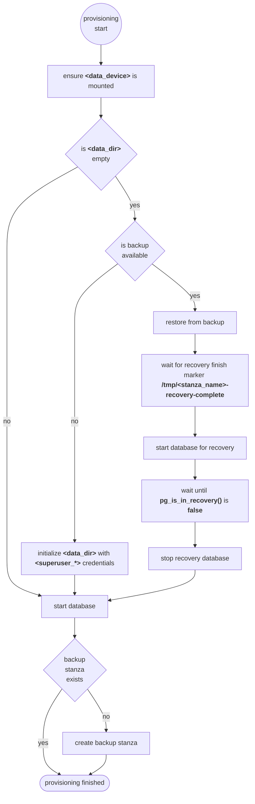

+++
title = "Ansible"
description = "Ansible role to install a PostgreSQL database with an all batteries included backup solution powered by pgBackRest"
overviewGroup = "rds"
faIcon = "fa-cloud"
+++

Ansible role to install a [PostgreSQL](https://www.postgresql.org/) database with an all batteries included backup
solution powered by [pgBackRest](https://pgbackrest.org/)

## Standalone

To prevent service interruption, the standalone, as well as the cluster role, will only stop/restart the PostgreSQL
service if explicitly told to do so. Otherwise, it will just start the service after the initial provisioning and
otherwise not
touch the running instance to avoid potential data loss or interference with manual processes.

The [standalone role](rds_postgresql/standalone) provisions a standalone PostgreSQL database with pgBackRest as a backup
solution. If started without any data, restore will automatically be started if a back is available.

### Overview

The full documentation of all configuration parameters is in
the [standalone role documentation](rds_postgresql/standalone), this section will only highlight some important options

#### Naming

All names for services, folders, backups etc. are created from the variables `environment_name` and `instance_name` name, where both are concatenated as `<environment_name>-<instance_name>`. If needed the derived names like `service_name`, `stanza_name` can be overridden. 


#### Backup

The target S3 compatible backup bucket can be configured using the `backup_s3_*` variables.

{}
Make sure you never loose the `backup_password` which is used to encrypt all backups. Without this password restore will not work.
{}

Per default full and incremental backups are enabled, the schedules can be tuned using the `backup_<full|incr>_schedule` variables.

#### Credentials

The name as well as the password of the database superuser can be configured using the `superuser_*` password variables.

#### Extensions

Several PostgreSQL extensions are available for installation by switching on the `extension_*_enabled` variables. 

### Usage

**Add Solidblocks RDS collection to Ansible requirements**

```yaml
---
collections:
  - name: https://github.com/pellepelster/solidblocks/releases/download/{}/blcks-rds_postgresql-{}.tar.gz
    type: url
```

**Apply role to database host**
```yaml
---
- name: "database1"
  hosts: database1
  become: true
  roles:
    - role: blcks.rds_postgresql.standalone
      instance_name: database1
      environment_name: prod
      superuser_password: foobar
      backup_password: foobar
      extension_pglogical_enabled: true
      extension_postgis_enabled: true
      extension_pgaudit_enabled: true
      extra_configuration:
        debug_pretty_print: "on"
```

### Provisioning Flow



### Operations

Naming for all services and helpers is based on the `<environment_name>-<instance_name>` naming convention.

#### Restart database

```shell
systemctl restart <environment_name>-<instance_name>
```

#### Show database log

```shell
journalctl --follow --unit <environment_name>-<instance_name>
```

#### Show available backups

**wrapper**
```shell
<environment_name>-<instance_name>-pgbackrest info
```

**pgbackrest**
```shell
pgbackrest --stanza=<environment_name>-<instance_name> info
```

#### Start psql

**wrapper**
```shell
<environment_name>-<instance_name>-psql postgres
```
**wrapper**
```shell
sudo -u postgres psql --user <superuser_name> postgres
```
