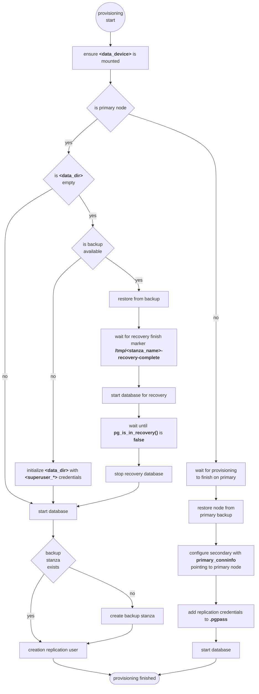

+++
title = "Cluster"
weight = 20
+++

## Overview

The full documentation of all configuration options is in the [cluster role documentation](rds_postgresql/cluster). For
general configuration, have a look at the generic role [documentation](rds/ansible).

## Usage

### Add Solidblocks RDS collection to Ansible requirements

```yaml
---
collections:
  - name: https://github.com/pellepelster/solidblocks/releases/download/{}/blcks-rds_postgresql-{}.tar.gz
    type: url
```

### Apply role to database host group

The role should be applied to a group of hosts, where the primary node will be the node configured by `primary_node`.

```yaml
---
- name: "database2"
  hosts: database2
  become: true
  roles:
    - role: blcks.rds_postgresql.cluster
      instance_name: database2
      environment_name: prod
      superuser_password: foobar
      backup_password: foobar
      replicator_password: foobar
      private_subnet: "10.0.1.0/24"
```

## Configuration

The cluster setup has some additional mandatory configuration options

| variable              | description                                                                |
|-----------------------|----------------------------------------------------------------------------|
| `primary_node`        | Ansible hostname of the primary node                                       |
| `private_subnet`      | IP subnet that is shared by all database nodes                             |
| `replicator_password` | credentials used to authenticate the read replicas against to primary node |

## Provisioning Flow

