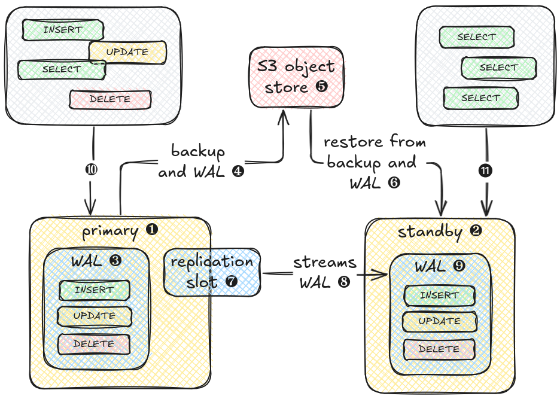
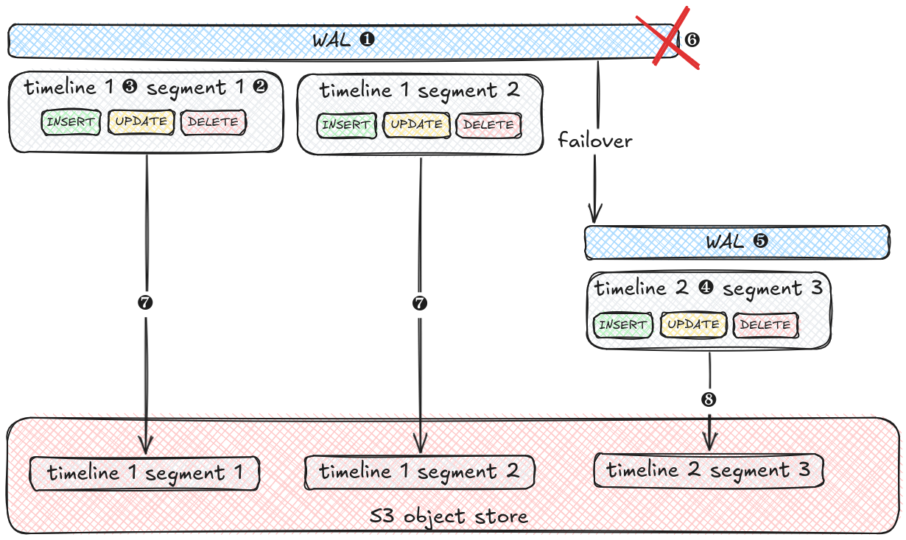
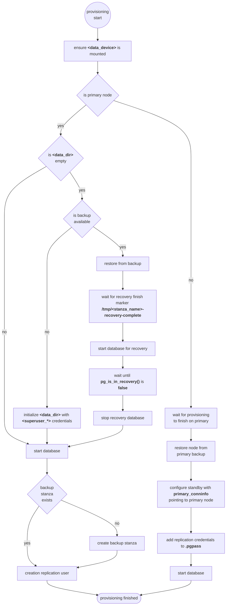

+++
title = "Cluster"
weight = 20
+++

## Overview

The full documentation of all configuration options is in the [cluster role documentation](rds_postgresql/cluster). For
general configuration, have a look at the common role [documentation](rds/ansible).

## Overview

### Cluster
A clustered PostgreSQL setup consists of at least two nodes. The [
primary](https://www.postgresql.org/docs/current/runtime-config-replication.html#RUNTIME-CONFIG-REPLICATION-PRIMARY) ❶
is the leading node for the cluster and also the node capable of answering read and write requests ❿. All incoming requests that alter data are stored in the Write-Ahead-Log WAL ❸. The WAL is divided into small segments that are continously transferred ❹ to an S3 compatible backup location ❺ along with the database data from full or incremental backups.
When a [standby](https://www.postgresql.org/docs/current/runtime-config-replication.html#RUNTIME-CONFIG-REPLICATION-STANDBY) ❷
node is created it retrieves all backup data from the S3 bucket ❻ and replays the received WAL segments on top of it. When the latest WAL segment is reached, it attaches to the primary's [replication slot](https://www.postgresql.org/docs/current/view-pg-replication-slots.html) ❼ and starts streaming all new WAL segments ❽. The standby node now has all up-to-data data from the primary ❾ and is able to answer read-only requests ⓫.



### WAL

The WAL ❶ stores all data altering operations in a log to be able to replay them in a crash or restore scenario. The WAL is divided into small (16MB) files called segments ❷ that are numbered in ascending order. Each WAL (segment) also has a unique timeline id ❸. When failover happens, e.g. in case of an outage of the primary node, the WAL on the new node ❺ restored from the backup gets a new timeline id ❹ to prevent clashes with WAl segments from the other nodes. 

Nodes that are attached to replication slots have to be on the same timeline id as the node offering the replication slot. This is especially important after failover, when a node dies ❻. If the latest WAL segments that were pushed to the backup repository are still from the old node ❼, attaching a node that was restored from this backup to the replication slot of the new node ❺ will fail, because they are on the different timelines. Only when a new backup is pushed from the new node ❽, the backup repository is updated with the new timeline and nodes created form that backup can be attached to the primary again.


    

## Usage

### Add Solidblocks RDS collection to Ansible requirements

```yaml
---
collections:
  - name: https://github.com/pellepelster/solidblocks/releases/download/{}/blcks-rds_postgresql-{}.tar.gz
    type: url
```

### Apply role to database host group

Additional to the [common](rds/ansible) configuration options, the clustered setup also needs

| variable              | description                                                                |
|-----------------------|----------------------------------------------------------------------------|
| `primary_node`        | Ansible hostname of the primary node                                       |
| `private_subnet`      | IP subnet that is shared by all database nodes                             |
| `replicator_password` | credentials used to authenticate the standby nodes against to primary node |


```yaml
---
- name: "database2"
  hosts: database2
  become: true
  roles:
    - role: blcks.rds_postgresql.cluster
      instance_name: database2
      environment_name: prod
      superuser_password: foobar
      backup_password: foobar
      replicator_password: foobar
      private_subnet: "10.0.1.0/24"
```

## Provisioning Flow

