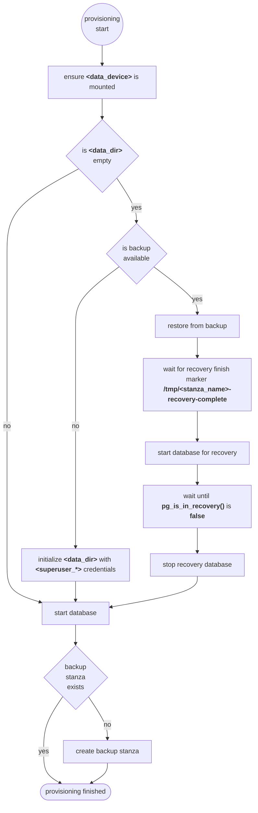

+++
title = "Standalone"
weight = 10
+++

## Overview

The full documentation of all configuration options is in the [standalone role documentation](rds_postgresql/standalone). For general configuration, have a look at the generic role [documentation](rds/ansible).

## Usage

### Add Solidblocks RDS collection to Ansible requirements

```yaml
---
collections:
  - name: https://github.com/pellepelster/solidblocks/releases/download/{}/blcks-rds_postgresql-{}.tar.gz
    type: url
```

### Apply role to database host
```yaml
---
- name: "database1"
  hosts: database1
  become: true
  roles:
    - role: blcks.rds_postgresql.standalone
      instance_name: database1
      environment_name: prod
      superuser_password: foobar
      backup_password: foobar
```

### Version upgrades

The database can be updated by setting the roles `<postgres_version>` variable to the desired major version, where all versions from the official PostgreSQL repository are available as described in the general [documentation](../#packages). 


For details of the update process please refer to this [part](../#version-upgrades) of the documentation, the following steps are recommended for a version upgrade:

* execute a full backup [backup](../runbooks/general/#trigger-full-backup)
* update `<postgres_version>` to desired target version
* execute Ansible playbook


## Provisioning Flow

