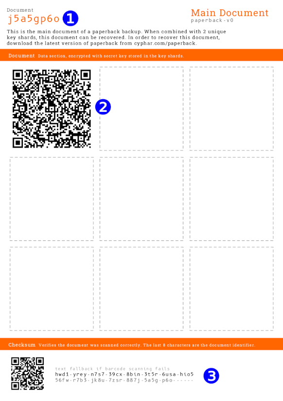
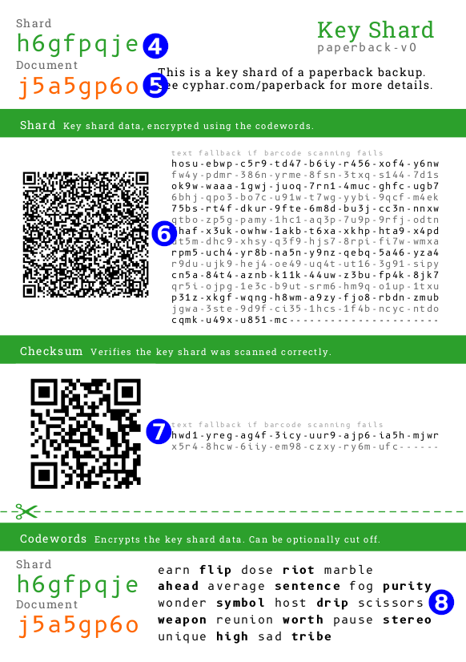

+++
title = "Paperback offline backup"
description = "Offline backup for credentials"
+++

For disaster recovery purposes, it is crucial to always have access to all secrets that are needed to black start your
environments from zero. Depending on your setup, those credentials can be

* root passwords for secret managers
* passwords for encrypted backups
* GPG encryption keys
* root credentials for cloud accounts
* private keys for PKI infrastructures

To make sure the backup is secure and reliable, the following requirements should be met

* it should be human and machine-readable, in a clear and easy-to-read format that is trivial to convert back to digital
* should not be stored in plaintext but use a proper encryption algorithm
* the encryption should support distributed trust, so that no single person in possession of the backup can access the
  secrets alone
* be stored on non-digital mediums to avoid accidental deletion or exposure
* have multiple copies that are geographically redundant and distributed to protect from single-point of failure (e.g.,
  house fire, flood)
* stored in a secure, tamper-proof location
* written guides for rotation and recovery exist and are regularly tested and trained
* include checksums or validation words to be able to verify the correct entry during recovery

## paperback

[paperback](https://github.com/cyphar/paperback) is a paper-based backup scheme that is secure, easy-to-use and can
fulfil those requirements. Backups are encrypted, and the secret key is split into numerous `key shards` which can be
stored separately (by different individuals), removing the need for any individual to memorise a secret passphrase.

### Download

| File                                                | Sha256 Checksum                                                    |
|-----------------------------------------------------|--------------------------------------------------------------------|
| [Windows i686](paperback-i686-windows-msvc.exe)     | `80fe0f8c9f490c213897a1f9db51e615ec779db06e245ae624761217eaf3d77f` |
| [Windows x86_64](paperback-x86_64-windows-msvc.exe) | `37833b70fc4c4a620e940242e596da437c557a3570c3472be07859afa7ff4e0f` |
| [Apple x86_64](paperback-x86_64-apple-darwin)       | `50baacfcceb1aaa302972a7a5eb2e1946b07ed719efc9985b5cfed1eee09c070` |
| [Linux x86_64](paperback-x86_64-unknown-linux-musl) | `41dbbb0e4e9b3217e16bb06ad4157d6dc2792e261790a005854bed915ec057e6` |

## Backup

To create a backup of sensitive data, execute the following steps

### Write secrets to a file

**backup.txt**

```
foo-bar
```

### Create backup documents from file

Depending on your needs, define the total number of `key_shards` you want to distribute and a `quorum` which is the
number
of key shards needed to restore the secrets from the backup

```shell
paperback backup --quorum-size <quorum> --shards <key_shards> backup.txt
```

### Distribute PDFs

`paperback` backup will create a main document with a unique `document_id` and `n` key shards with unique `key_shard_id`
s

```
main_document-<document_id>.pdf
key_shard-<document_id>-<key_shard_id>.pdf
key_shard-<document_id>-<key_shard_id>.pdf
key_shard-<document_id>-<key_shard_id>.pdf
key_shard-<document_id>-<key_shard_id>.pdf
```

Each storage location should contain a copy of the main document and a single key shard.

{}
When printing the documents, please keep in mind that the printer may keep your printed documents in memory or on disk. 

Also consider to user archival paper, which is a grade of paper that is designed to last longer than ordinary copy paper.
{}

#### Main document

The main document consists of

* ❶ the `document_id`
* ❷ the encrypted document data
* ❸ a checksum that can be used to verify document data entry during restore



#### Key shard

The key shard document contains

* ❹ the `key_shard_id`
* ❺ the `document_id`
* ❻ the encrypted key shard data
* ❼ a checksum that can be used to verify the key shard data entry during restore
* ❽ codewords to decrypt the key shard data



### Clean up

After document distribution, clean up the machine where the backup was created and remove the PDFs and the secret file.

## Recovery

Start the interactive recovery process with the target file where the record data should be written to

```shell
paperback recover --interactive recover.txt
```

To recover, you need to enter

* the encrypted document data (❷)
* a `<quorum>` number of
    * encrypted key shard data (❻)
    * codewords to decrypt the key shard data (❽)

into the recovery process

```
Enter a main document code (unknown number of codes remaining): <❷>

Main document checksum: ❸
Document ID: <document_id>
<quorum> key shards required.
Quorum contains [] key shards.
Enter key shard 1 of 2: <❻>

Key shard 1 checksum: ❼
Enter key shard 1 codewords: <❽>

Loaded key shard ❹.
Quorum contains [❹] key shards.
Enter key shard 2 of 2: <❻>

Key shard 2 checksum: ❼
Enter key shard 2 codewords: <❽>

Loaded key shard ❹.
```

The recovered data will be written to `recover.txt`
