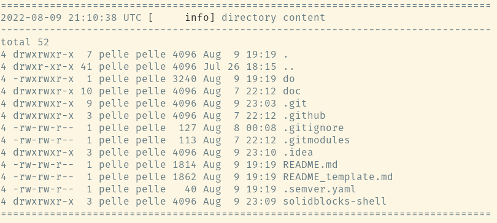

Generic console and logging  helpers

## Functions

### `log_echo_error(message)` {#log_echo_error}
Logs a red message to STDERR

```shell
source "log.sh"

log_echo_error "error text"
```

**output**


### `log_[info|success|warning|debug|error](message)` {#log}
Logs a message with timestamp and colored log level 
```shell
source "log.sh"

log_info "info message"
log_success "success message"
log_warning "warning message"
log_debug "debug message"
log_error "error message"
```

**output**


### `log_die(message)` {#log_die}
Logs a fatal message with timestamp and exits with error code `1` 
```shell
source "log.sh"

log_die "fatal message"
```

**output**


### `log_divider_header(message)` {#log_divider_header}

Logs a visual divider for multiline command output 

```shell
source "log.sh"

log_divider_header "directory content"
ls -lsa
log_divider_footer
```

**output**
