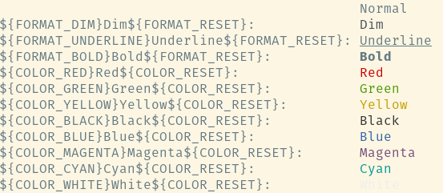

Constants for console text formatting

## Constants

Use the following constants 
```śhell
echo "${FORMAT_DIM}Dim${FORMAT_RESET}"
echo "${FORMAT_UNDERLINE}Underline${FORMAT_RESET}"
echo "${FORMAT_BOLD}Bold${FORMAT_RESET}"
echo "${COLOR_RED}Red${COLOR_RESET}"
echo "${COLOR_GREEN}Green${COLOR_RESET}"
echo "${COLOR_YELLOW}Yellow${COLOR_RESET}"
echo "${COLOR_BLACK}Black${COLOR_RESET}"
echo "${COLOR_BLUE}Blue${COLOR_RESET}"
echo "${COLOR_MAGENTA}Magenta${COLOR_RESET}"
echo "${COLOR_CYAN}Cyan${COLOR_RESET}"
echo "${COLOR_WHITE}White${COLOR_RESET}"
```

to format text like this


